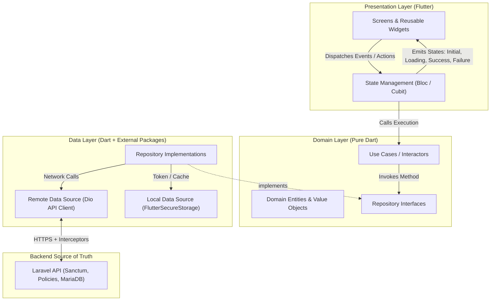

# Flutter Client Architecture

## 1. Architectural Philosophy & Source of Truth

The Flutter mobile application is a client consumer for the multi-tenant Laravel backend (`school-api`). 

### Core Principles
1. **Laravel Backend as the Sole Source of Truth (SSoT)**:
   - Tenant resolution, authentication, authorization, role-based access control (RBAC), relationship scoping, business validation, data retention, and financial calculations are enforced exclusively by the backend.
   - The Flutter app must **never** assume an operation is permitted simply because a UI element was visible or enabled.
2. **Zero-Trust Client Boundary**:
   - Client-side permission checks (`abilities.contains(...)`, `user_type == 'teacher'`) exist **strictly for User Experience (UX)**—to render appropriate navigation shells, hide irrelevant action buttons, and provide immediate feedback.
   - The Laravel API enforces every gate and policy on every request. If the client makes an unauthorized call, the backend returns HTTP 403 (`forbidden`) or HTTP 404 (`not_found`), which Flutter must handle gracefully.
3. **Immutable Identity & Tenant Context**:
   - The mobile application connects using the authenticated principal's context. The client never supplies or overrides `school_id`, `created_by`, or `user_type` in request bodies.
   - Multi-tenancy is established at login using the school slug, which is validated by Laravel and bound to the issued Sanctum Bearer token.
4. **Resilient Unidirectional Data Flow (UDF)**:
   - UI emits user intents $\rightarrow$ State management processes events $\rightarrow$ Domain use cases execute business rules $\rightarrow$ Repositories coordinate remote/local data sources $\rightarrow$ State transitions emit immutable states $\rightarrow$ UI renders reactive states.

---

## 2. Layered Architecture (Feature-First Clean Architecture)

```
lib/
├── core/         # Shared cross-cutting infrastructure
├── shared/       # Reusable UI widgets, guards, and display state views
└── features/     # Domain-driven vertical feature slices
```



### 2.1 Core Boundary (`lib/core/`)
Contains cross-cutting system logic that does not belong to any single business feature:
* **Network**:
  * `ApiClient`: Configured `Dio` client instance.
  * `AuthInterceptor`: Attaches `Authorization: Bearer <token>`, `Accept: application/json`.
  * `ErrorInterceptor`: Catches HTTP errors and parses the backend error envelope into typed `Failure` objects.
  * `ListQuery`: Client utility mirroring Laravel's `App\Http\Api\ListQuery` for cursor pagination (`per_page`, `cursor`, `filter[...]`, `sort`).
* **Storage**:
  * `SecureStorageService`: Wraps `flutter_secure_storage` (Android EncryptedSharedPreferences, iOS Keychain) for tokens and tenant session data.
  * `PreferencesService`: Wraps `shared_preferences` for non-sensitive UX settings (theme, locale).
* **Errors**:
  * `Failure`: Base abstract class for domain failures (`NetworkFailure`, `UnauthorizedFailure`, `ForbiddenFailure`, `NotFoundFailure`, `ValidationFailure`, `ServerFailure`).
* **Theme & Design Tokens**:
  * Material 3 color schemes, typography tokens, status extensions (attendance colors, fee status badges).

### 2.2 Shared Boundary (`lib/shared/`)
Contains reusable presentation components consumed across multiple features:
* **Components**: Buttons (`AppPrimaryButton`), text inputs (`AppTextField`), cards, avatars, badges.
* **Guards**: `PermissionGuard` and `RoleGuard` widgets for conditional UX rendering.
* **Feedback States**: `ShimmerLoadingView`, `EmptyStateView`, `ErrorStateView`.

### 2.3 Feature Boundary (`lib/features/`)
Each business capability is an isolated slice containing three sub-layers:
1. **Presentation (`features/<feature>/presentation/`)**:
   * Screens, pages, dialogs, and feature-specific widgets.
   * State holders (`Bloc` or `Cubit`) managing UI lifecycle and view states.
2. **Domain (`features/<feature>/domain/`)**:
   * Pure Dart entities and value objects (no Flutter or Dio dependencies).
   * Abstract repository contracts defining required operations.
   * Use cases orchestrating single units of business work.
3. **Data (`features/<feature>/data/`)**:
   * Remote data sources executing HTTP requests via `ApiClient`.
   * Models and DTOs parsing backend JSON responses into typed domain entities.
   * Concrete repository implementations implementing the domain repository interfaces.

---

## 3. Request & Response Lifecycle

```
[User Action]
      │
      ▼
[Bloc / Cubit] ──> emits State.loading()
      │
      ▼
[Domain Use Case]
      │
      ▼
[Repository Impl]
      │
      ├──> [Remote Data Source] ──> [Dio Client]
      │                                   │
      │                                   ├──> [AuthInterceptor] (adds Bearer token)
      │                                   ├──> [HTTP Request to Laravel]
      │                                   └──> [ErrorInterceptor] (intercepts non-2xx)
      │
      ├──> Returns Either<Failure, Entity>
      ▼
[Bloc / Cubit]
      │
      ├──> On Success: emits State.success(data)
      └──> On Failure: emits State.failure(error)
      ▼
[UI / Screen] ──> Renders updated state (Shimmer -> Content / Error Banner)
```

---

## 4. Multi-Role Navigation & Session Dispatch

1. **App Launch**:
   * `SplashView` reads the persisted Bearer token from secure storage.
   * If no token exists $\rightarrow$ Redirect to `LoginView`.
   * If token exists $\rightarrow$ Call `GET /api/v1/common/me`.
2. **Role & Capability Evaluation**:
   * Read `data.user_type` and `data.abilities` from `AccountResource`.
   * If `user_type == 'teacher'` $\rightarrow$ Dispatch to `TeacherDashboardShell` (`/teacher/home`).
   * If `user_type == 'staff'` $\rightarrow$ Dispatch to `AdminDashboardShell` (`/school/dashboard`).
   * If `user_type == 'parent'` $\rightarrow$ Render Parent Shell (Blocked until Phase 3/4 backend delivery).
   * If `user_type == 'student'` $\rightarrow$ Render Student Shell (Blocked until V1.5 backend delivery).
3. **Session Invalidation**:
   * Any API call returning HTTP 401 (`unauthenticated`) immediately notifies `AuthBloc`.
   * `AuthBloc` wipes the secure storage token and routes the user back to `LoginView` with a clear re-authentication message.

